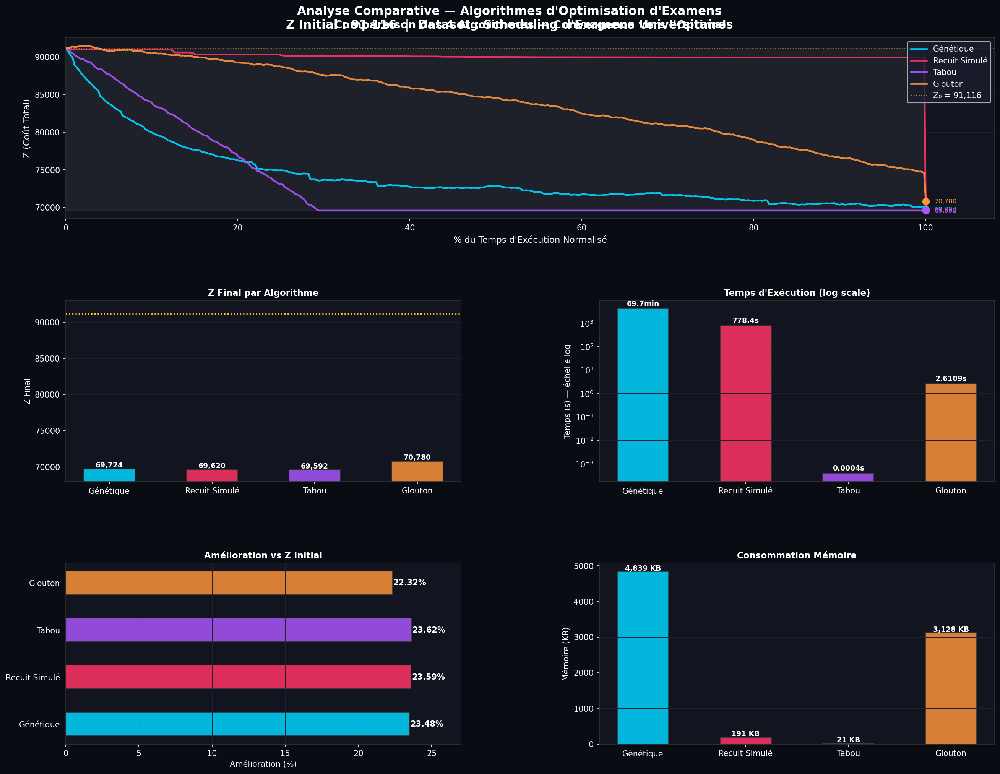

# 📅 Optimisation de l'Ordonnancement des Examens par Métaheuristiques

> Projet d'optimisation combinatoire — Comparaison de 4 algorithmes pour minimiser le stress étudiant lors de la planification d'examens universitaires.

---

## 🎯 Problématique

Le problème de l'ordonnancement des examens est un défi **NP-difficile** : étant donnés **N examens** à programmer sur **P périodes**, et une matrice de conflits indiquant combien d'étudiants sont inscrits à chaque paire d'examens, comment **minimiser la fonction de coût Z** (stress des étudiants) en espaçant au maximum les examens conflictuels ?

$$Z = \sum_{i < j} C_{ij} \cdot w_{|p_i - p_j|}$$

où `C_ij` est le nombre d'étudiants communs aux examens `i` et `j`, et `w` est le vecteur de poids selon la distance entre périodes.

---

## 🗂️ Structure du projet

```
📁 projet_exam/
│
├── 📓 RecuitSimule_Sarra.ipynb           # Notebook — Recuit Simulé
├── 📓 AlgorithmeGenetique_Sarra.ipynb    # Notebook — Algorithme Génétique
├── 📓 RechercheTabou_Sarra.ipynb         # Notebook — Recherche Tabou
├── 📓 AlgorithmeGlouton_Sarra.ipynb      # Notebook — Algorithme Glouton
├── 📓 Comparaison_des_Performances.ipynb # Notebook — Comparaison
│
├── 🐍 algorithme_glouton.py              # Script Python — Glouton
├── 🐍 recuit_simule.py                   # Script Python — Recuit Simulé
├── 🐍 algorithme_genetique.py            # Script Python — Génétique
├── 🐍 recherche_tabou.py                 # Script Python — Tabou
├── 🐍 comparaison_performances.py        # Script Python — Comparaison
│
├── 📊 exam_scheduling_data_readable.xlsx # Dataset principal
└── 📁 images/
    └── courbes_convergence.png           # Courbes de convergence des algorithmes
```

📥 **Dataset :** [`exam_scheduling_data_readable.xlsx`](https://github.com/sarra725/planification-examens-metaheuristiques/blob/main/01_data/01_premiere_data.xlsx)
- `Conflict_Matrix` — Matrice de conflits entre examens
- `Weights` — Vecteur de poids par distance entre périodes
- `Schedule` — Planning initial de référence

---

## ⚙️ Algorithmes implémentés

### 🟠 Algorithme Glouton (Greedy) — Baseline
Assigne chaque examen à la période qui minimise le coût partiel à ce stade, sans jamais revenir en arrière. Utilisé comme **référence de comparaison**.

📄 [`algorithme_glouton.py`](https://github.com/sarra725/planification-examens-metaheuristiques/blob/main/02_scripts/01_%20algorithmes/01_glouton.ipynb)

---

### 🔴 Recuit Simulé (Simulated Annealing)
Inspiré du refroidissement des métaux. Accepte parfois des solutions moins bonnes (avec une probabilité décroissante selon la température) pour s'échapper des minima locaux.

- **Paramètres clés :** T_init = 1000, T_final = 0.1, 18 000 itérations
- **Voisinage :** réaffectation aléatoire d'un examen à une autre période

📄 [`recuit_simule.py`](https://github.com/sarra725/planification-examens-metaheuristiques/blob/main/02_scripts/01_%20algorithmes/03_recuit_simule.ipynb)

---

### 🔵 Algorithme Génétique (GA)
S'inspire de l'évolution naturelle. Maintient une **population de solutions** avec sélection, croisement et mutation pour explorer l'espace des solutions.

- **Paramètres clés :** population = N individus, 200 générations
- **Opérateurs :** sélection par tournoi, croisement à un point, mutation aléatoire

📄 [`algorithme_genetique.py`](https://github.com/sarra725/planification-examens-metaheuristiques/blob/main/02_scripts/01_%20algorithmes/04_genetique.ipynb)

---

### 🟣 Recherche Tabou (Tabu Search)
Maintient une **liste tabou** des mouvements récemment effectués pour éviter les cycles et explorer efficacement le voisinage.

- **Paramètres clés :** taille tabou = 20, 150 itérations
- **Stratégie :** meilleur voisin non-tabou à chaque itération

📄 [`recherche_tabou.py`](https://github.com/sarra725/planification-examens-metaheuristiques/blob/main/02_scripts/01_%20algorithmes/02_tabu_search.ipynb)

---

## 📊 Résultats & Comparaison

| Algorithme | Z Initial | Z Final | Amélioration | Temps | Mémoire |
|:---|:---:|:---:|:---:|:---:|:---:|
| 🟠 **Glouton** | 91 116 | 70 780 | 0% (baseline) | < 1s | — |
| 🔴 **Recuit Simulé** | 91 116 | 69 620 | **23.55%** | ~778s | 190 KB |
| 🔵 **Génétique** | 91 116 | 69 724 | **23.48%** | ~4 179s | 4 839 KB |
| 🟣 **Tabou** | 91 116 | **69 592** | **23.62%** | ~0.4ms | 20 KB |

> 💡 **Conclusion :** La **Recherche Tabou** obtient le meilleur score Z avec une mémoire et un temps très faibles. L'**Algorithme Génétique** est très sensible aux hyperparamètres et pourrait encore s'améliorer avec une population plus large.

---

## 📈 Courbes de Convergence

Les courbes ci-dessous illustrent l'évolution de la fonction Z au fil des itérations pour chaque algorithme.



> *Les courbes montrent clairement la différence de comportement : le Glouton converge rapidement sans exploration, tandis que le Recuit Simulé et l'Algorithme Génétique oscillent avant de se stabiliser. La Recherche Tabou affiche une descente directe et efficace.*

---

## 🚀 Installation & Utilisation

### Prérequis

```bash
pip install pandas numpy matplotlib openpyxl
```

### Lancer un script Python

```bash
python algorithme_glouton.py
python recuit_simule.py
python algorithme_genetique.py
python recherche_tabou.py
python comparaison_performances.py
```

### Lancer un notebook

```bash
jupyter notebook RecuitSimule_Sarra.ipynb
```

> ⚠️ **Important :** Avant de lancer, vérifier que le dataset est bien à la racine du projet ou adapter le chemin :
> ```python
> file_path = "exam_scheduling_data_readable.xlsx"
> ```

### Ordre recommandé

1. Commencer par `algorithme_glouton.py` (baseline)
2. Tester les métaheuristiques : Recuit Simulé, Génétique, Tabou
3. Lancer `comparaison_performances.py` pour les visualisations

---

## 📦 Dépendances

| Bibliothèque | Usage |
|---|---|
| `pandas` | Chargement et manipulation du dataset Excel |
| `numpy` | Calculs matriciels et numériques |
| `matplotlib` | Visualisation des courbes de convergence |
| `openpyxl` | Lecture des fichiers `.xlsx` |
| `time` & `tracemalloc` | Mesure des performances (temps & mémoire) |

---

## 👩‍💻 Auteure

**Sarra** — Étudiante en Optimisation Combinatoire  
Projet réalisé dans le cadre d'un cours d'optimisation et de métaheuristiques.
